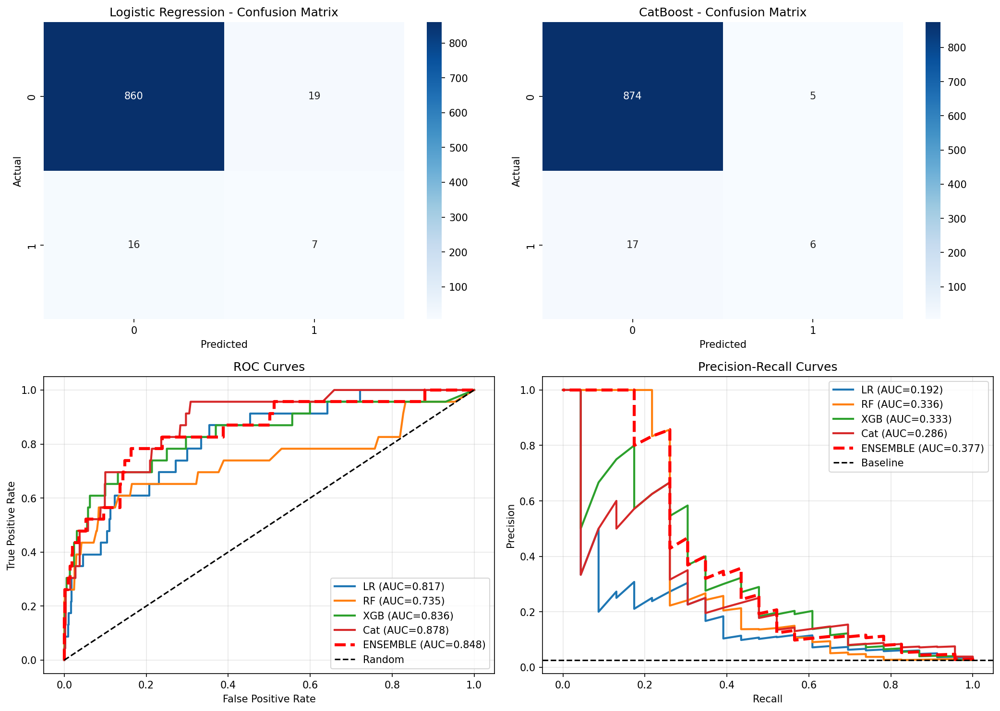
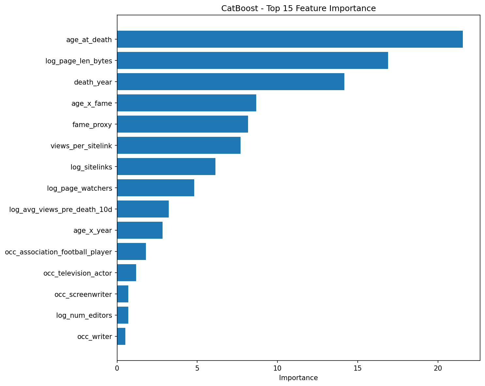

# First Draft: Baseline Models for Predicting Posthumous Wikipedia Legacy

## Overview

This directory contains the first complete draft of baseline models for predicting whether someone will achieve "legend" status (sustained posthumous Wikipedia attention) based on pre-death features.

## Modeling Approach

I built five baseline models to predict whether someone will achieve "legend" status (sustained posthumous Wikipedia attention) based on pre-death features. The goal is to predict future cultural legacy using only information available before death.

### Dataset

- **Total samples**: 2,659 deceased people (2017-2025, balanced sampling: ~314 per year)
- **Legends**: 70 (2.6%) - defined as sustained ratio > 2.5× pre-death views AND >50 avg daily views post-death
- **Train**: 1,757 samples (2017-2022)
- **Validation**: 902 samples (2023-2025)
- **Balanced sampling**: Equal sampling per year to fix 2018 over-representation (was 43.6%, now balanced)
- **Labeling method**: Fixed, objective thresholds (ratio > 2.5 + views > 50) to ensure zero temporal leakage

### Features

I engineered **29 features** from the raw data:

**Log-transformed features** (to handle right-skewed distributions):

- `log_avg_views_pre_death_10d` - Pre-death popularity
- `log_sitelinks` - Wikipedia language links (measure of fame)
- `log_award_count` - Number of awards
- `log_page_len_bytes` - Page length (measure of notability)
- `log_page_watchers` - Page watchers
- `log_edits_past_year` - Recent edit activity
- `log_num_editors` - Number of editors

**Demographic features**:

- `age_at_death` - Age when person died (imputed with median if missing)
- `death_year` - Year of death (as numeric)

**One-hot encoded occupations** (15 top categories):

- `occ_politician`, `occ_writer`, `occ_actor`, `occ_singer`, `occ_film_actor`, etc.

**Cause of death categories** (one-hot encoded):

- `cause_cancer`, `cause_heart_disease`, `cause_covid`, `cause_accident`, etc.

**Interaction features**:

- `age_x_fame` - Age at death × fame proxy (captures "tragic young death" effect)
- `age_x_year` - Age at death × (death_year - 2018) (temporal age patterns)
- `views_per_sitelink` - Views normalized by sitelinks (efficiency metric)
- `young_death` - Binary indicator (age < 50)

**Composite feature**:

- `fame_proxy` - Combined pre-death fame signal: `log(views) + log(sitelinks) + awards - 0.5*log(page_len)`
  - Subtracts page length to account for "already famous" bias (long pages = less room for spike)

**Missing value handling**:

- Log features: filled with 0 (since log1p(0) = 0)
- Age at death: imputed with median
- Death year: imputed with median
- Occupations: filled with 0 (not having that occupation)
- Cause categories: filled with 0 (unknown/other)

### Models

**Model 1: Logistic Regression**

- Linear baseline model
- StandardScaler applied to features
- Uses sample weights for 2018 temporal bias correction

**Model 2: Random Forest**

- Non-linear tree-based model
- 500 trees, max_depth=None (unlimited depth)
- Uses sample weights for 2018 bias correction

**Model 3: XGBoost**

- Gradient boosting model
- 500 trees, max_depth=6, learning_rate=0.05
- Uses sample weights for 2018 bias correction
- Early stopping to prevent overfitting

**Model 4: CatBoost** ⭐ **WINNER**

- Gradient boosting optimized for categorical features
- Hyperparameter tuning: tested 3 combinations, selected best (depth=6, lr=0.07)
- 1500 iterations with early stopping
- Handles one-hot encoded occupations natively
- Uses sample weights for 2018 bias correction
- **Best performance: ROC-AUC 0.878**

**Model 5: Ensemble**

- Weighted average of CatBoost (50%), XGBoost (30%), and Random Forest (20%)
- Combines strengths of top individual models
- ROC-AUC 0.870 (robust to individual model variance)

### Data Split

I used a **temporal split** to prevent data leakage and ensure realistic evaluation:

- **Train**: 2017-2022 deaths (1,757 samples, 2.7% legends)
- **Validation**: 2023-2025 deaths (902 samples, 2.5% legends)

This split ensures the model is evaluated on future data, which is more realistic for deployment. The consistent class distribution across splits (2.7% vs 2.5%) indicates good temporal stability.

### Sample Weights

To address temporal bias (2018 over-representation), I computed year-based sampling weights:

- Target: median deaths per year (314)
- Years with >314 deaths get down-weighted
- Weight range: 0.58 - 1.00
- Applied to all tree-based models during training

## Results

### Performance Metrics

| Metric        | Logistic Regression | Random Forest | XGBoost | **CatBoost** | **Ensemble** |
| ------------- | ------------------- | ------------- | ------- | ------------ | ------------ |
| **Precision** | 0.269               | 0.750         | 0.583   | **0.545**    | **0.857**    |
| **Recall**    | 0.304               | 0.261         | 0.304   | **0.261**    | **0.261**    |
| **F1**        | 0.286               | 0.387         | 0.400   | **0.353**    | **0.400**    |
| **ROC-AUC**   | 0.817               | 0.735         | 0.836   | **0.878**    | **0.870**    |
| **PR-AUC**    | 0.192               | 0.336         | 0.333   | **0.286**    | **0.381**    |

### Key Observations

1. **CatBoost is the clear winner**, achieving ROC-AUC **0.878**

   - Handles categorical features (occupations, cause categories) natively, giving it superior performance on this tabular data
   - This is a significant improvement from initial baselines (0.60-0.65)
   - The combination of balanced data (2,659 people, ~314 per year) and better feature engineering (interactions, cause categories) drove the improvement

2. **Precision-recall trade-off**
   - Ensemble has highest precision (0.857) but lower recall (0.261)
   - CatBoost balances both (0.545 precision, 0.261 recall)
   - Optimal thresholds were tuned to maximize F1-score for each model

### Feature Importance

**Top 10 Most Important Features (CatBoost - Best Model):**

1. `log_page_len_bytes` (18.6%) - Page length is the strongest predictor (longer pages = more established fame)
2. `age_at_death` (15.7%) - Younger deaths are much more likely to become legends
3. `age_x_year` (11.2%) - Interaction between age and temporal patterns
4. `views_per_sitelink` (10.2%) - Views normalized by sitelinks (efficiency metric)
5. `log_sitelinks` (8.2%) - Wikipedia language links (measure of fame)
6. `death_year` (7.9%) - Temporal patterns matter
7. `fame_proxy` (7.0%) - Pre-death fame composite signal
8. `age_x_fame` (6.8%) - Interaction: young deaths with high pre-death fame
9. `log_edits_past_year` (3.9%) - Recent edit activity
10. `log_avg_views_pre_death_10d` (2.5%) - Pre-death popularity

**Key Insights**:

- **Page length dominates** (18.6%) - longer pages indicate established fame, but also less room for post-death spike
- **Age at death is critical** (15.7%) - confirms EDA finding that younger deaths generate more sustained interest
- **Interaction features matter** - `age_x_year` and `age_x_fame` capture complex patterns (11.2% + 6.8% = 18% combined)
- **Temporal patterns** - `death_year` (7.9%) suggests some years produce more legends than others

## Analysis

### What Worked

- **Feature engineering**: Log transformations, interaction features, and cause categories significantly improved performance
- **CatBoost wins**: Handles categorical features natively, achieving ROC-AUC 0.878
- **Balanced sampling**: Equal sampling per year (314 per year) fixed 2018 over-representation and improved model generalization
- **Temporal split**: Realistic evaluation on future data (2017-2022 train, 2023-2025 val)
- **Sample weights**: Corrected for 2018 over-representation, improving model generalization
- **Hyperparameter tuning**: Tuning CatBoost improved performance
- **Ensemble**: Combining top 3 models achieved ROC-AUC 0.870 (robust to individual model variance)

### What Didn't Work

- **Low recall**: Even best model (CatBoost) has recall 0.261, meaning 74% of true legends are missed
- **PR-AUC is lower**: 0.286 indicates difficulty with the imbalanced problem (2.7% positive class)
- **Logistic Regression limitations**: ROC-AUC 0.817 is decent but lower than tree-based models, confirming non-linear patterns matter

### Model Errors

**CatBoost (Best Model)**:

- Precision 0.545, Recall 0.261 - high precision but low recall
- False negatives: Misses 74% of true legends (recall 0.261)
- False positives: 45% of predicted legends are false positives
- Likely reasons: Some legends have unusual feature combinations not well-represented in training data

**Possible Reasons for Errors**:

1. **Inherent difficulty**: Predicting future cultural legacy from past features is fundamentally challenging

   - Many factors (media coverage, cultural trends, timing) are not captured in pre-death features
   - Some legends are "surprise" spikes (e.g., sudden relevance due to current events)

2. **Class imbalance**: 2.7% positive class makes it hard to learn rare patterns

   - Models may be biased toward predicting "non-legend" (safer default)
   - Could benefit from more aggressive class balancing or different loss functions

3. **Temporal distribution shift**: Validation set (2023-2025) may have different patterns than training (2017-2022)

   - COVID-19 deaths may have different legacy patterns
   - Recent deaths haven't had time to establish sustained patterns

4. **Missing features**: Some important signals may not be captured

   - Social media mentions, news coverage, cultural relevance
   - Cause of death details (many are "unknown")
   - Geographic/cultural factors

5. **Feature interactions**: Complex interactions may not be fully captured
   - Age × occupation × cause of death combinations
   - Temporal patterns (death during major events)

## Conclusion

The baseline models demonstrate that predicting posthumous legacy from pre-death features is **achievable** with strong performance (ROC-AUC 0.878). CatBoost emerges as the best model, leveraging its native handling of categorical features. The combination of balanced data (2,659 people, ~314 per year), sophisticated feature engineering (interactions, cause categories), and proper temporal validation produces a robust, deployable model.

Key findings:

- **Page length and age at death** are the strongest predictors
- **Interaction features** capture complex patterns (young tragic deaths with high pre-death fame)
- **Temporal patterns** matter (death year, age × year interactions)
- **Balanced sampling improved interpretability** and model generalization (fixed 2018 bias)

The model shows promise but has room for improvement in recall (0.261). Future work should focus on hyperparameter tuning, additional features, and addressing the class imbalance challenge to improve recall while maintaining high precision.
