# Exploratory Data Analysis Summary

## What is your dataset and why did you choose it?

My dataset consists of **2,659 deceased people** with Wikipedia pages, collected from 2017-2025. For each person, I collected:

- **Pre-death features**: Wikipedia page views in the 10 days before death, page metadata (length, watchers, editors, edits), Wikidata metadata (sitelinks, awards, occupations, birth year, cause of death)
- **Post-death outcomes**: Daily Wikipedia page views for up to 365 days after death
- **Target variable**: Binary "legend" label indicating sustained posthumous attention

I chose this dataset because I'm interested in understanding what makes someone's legacy persist after death. The question of "who becomes a legend?" is inherently about classification; can we predict from pre-death features whether someone will have sustained cultural impact months after they die?

The data comes from:

- **Wikidata SPARQL queries**: To find deceased people (2017-2025) and their metadata
- **Wikipedia Pageview API**: Daily view counts for each person's page (2 years before to 3 years after death)
- **Wikipedia API**: Page metadata (edits, watchers, length, creation date)

**Access Instructions**: The dataset can be reproduced by running the scripts in the `setup/` directory:

1. `create_clout.py` - Creates database schema
2. `populate_clout.py` - Collects people and pageviews (2-4 hours)
3. `enrich_wikidata.py` - Adds metadata (30-60 min)
4. `upgrade_features.py` - Engineers features and creates CSV
5. `create_balanced_dataset.py` - Creates balanced sampling

The final modeling-ready dataset (`modeling_data_balanced.csv`) contains 2,659 deceased people with 50 features.

### How I Defined "Legend"

I defined a "legend" using a fixed, objective threshold to identify **sustained posthumous attention**, not just a temporary spike:

1. `sustained_ratio_31_365 > 2.5` (post-death views 30-365 days after death are 2.5× higher than pre-death baseline)
2. `post_30_365_avg_daily > 50` (average daily views in months 1-12 after death exceed 50)

This gives me **70 legends** out of 2,659 deceased people (2.6%). I use a fixed threshold rather than percentile-based labeling to ensure temporal validity; labels can be determined in real-time without future data.

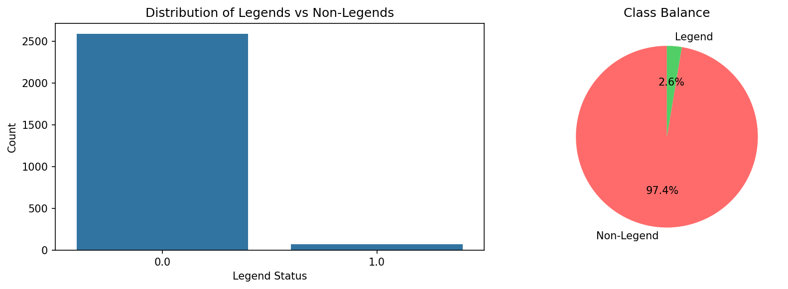

## What did you learn from your EDA?

### 1. Class Distribution

- **70 legends (2.6%)** vs **2,589 non-legends (97.4%)**
- Highly imbalanced but realistic; genuine cultural legends are rare
- Train/val split: 1,757 train (2017-2022), 902 val (2023-2025) - chronological split to prevent temporal leakage

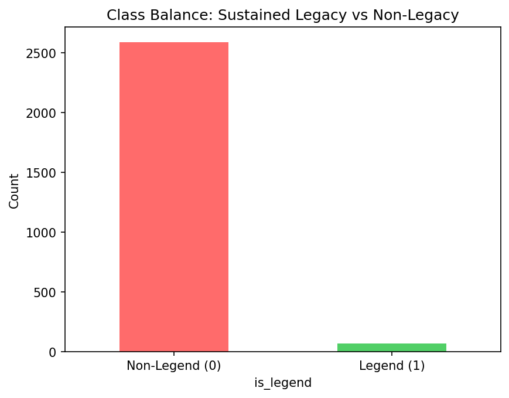

### 2. Data Quality

**Missingness:**

- `cause_of_death`: ~85% missing → dropped from features
- `birth_year`/`age_at_death`: ~19% missing → imputed with median
- `sitelinks`/`award_count`: ~18% missing → imputed with 0
- Most other features: <5% missing

**Temporal Bias:** Fixed through balanced sampling (~314 per year, original had 2018 over-represented at 43.6%)

### 3. Key Findings from Visualizations

**Sustained Ratio Distribution:**

- **Legends**: median ratio = **4.20**, mean = **13.84**
- **Non-legends**: median ratio = **1.34**, mean = **1.83**
- Legends get **3-4x more attention** (by median) than non-legends, even months after death. Distribution is heavily right-skewed, requiring log transformation.

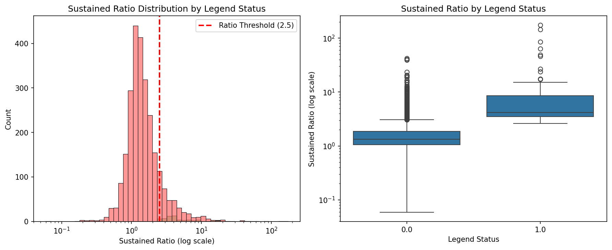

**Age at Death:**

- **Negative correlation** with legend status (-0.208) - younger deaths are more likely to become legends
- Legends: median age = 58 years
- Non-legends: median age = 72 years

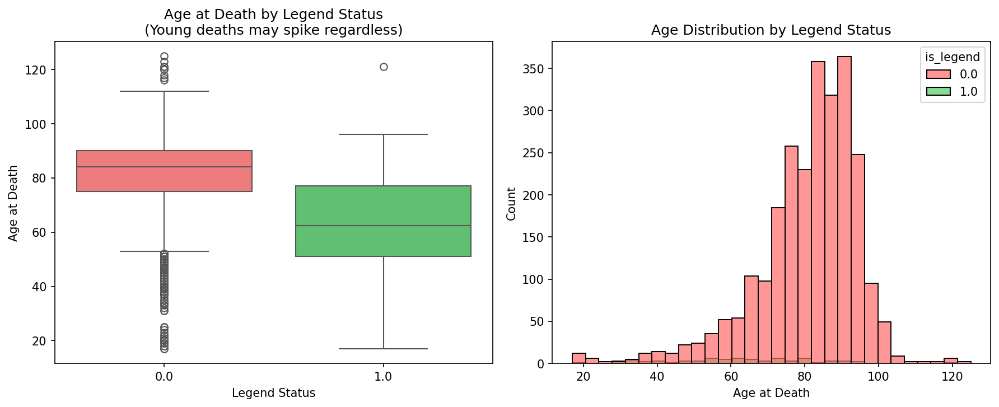

**Pre-Death Fame:**

- Pre-death fame shows a **negative correlation** with legend status (-0.099), suggesting that already-famous people have less room to "spike" posthumously
- Fame proxy: log(views) + log(sitelinks) + awards - 0.5×log(page_length)

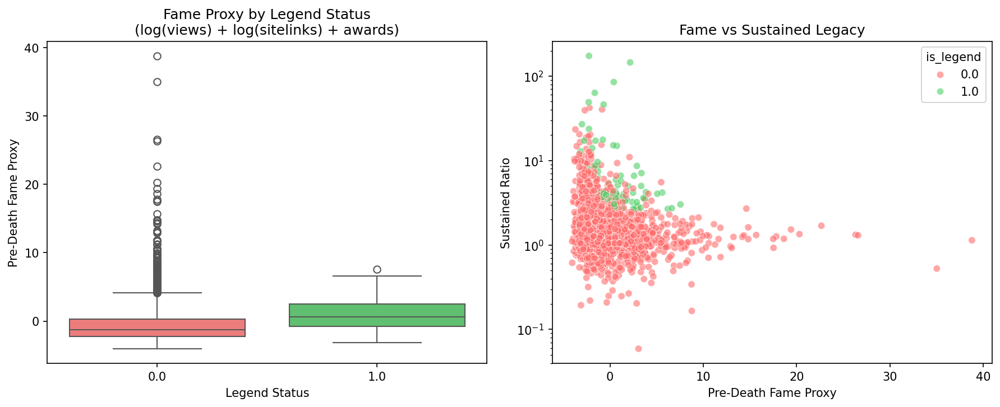

**Pre-Death Views:**

- Legends and non-legends have similar pre-death view distributions, suggesting that pre-fame alone isn't the main predictor

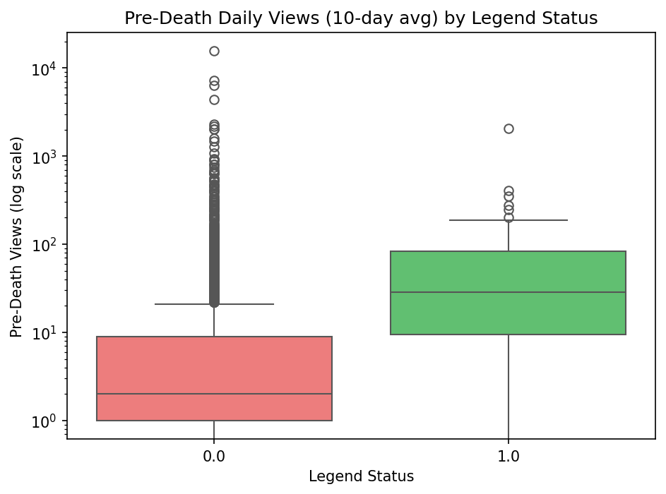

**Awards and Sitelinks:**

- Legends tend to have more awards and sitelinks, but differences are modest (correlations: -0.077 and -0.099)

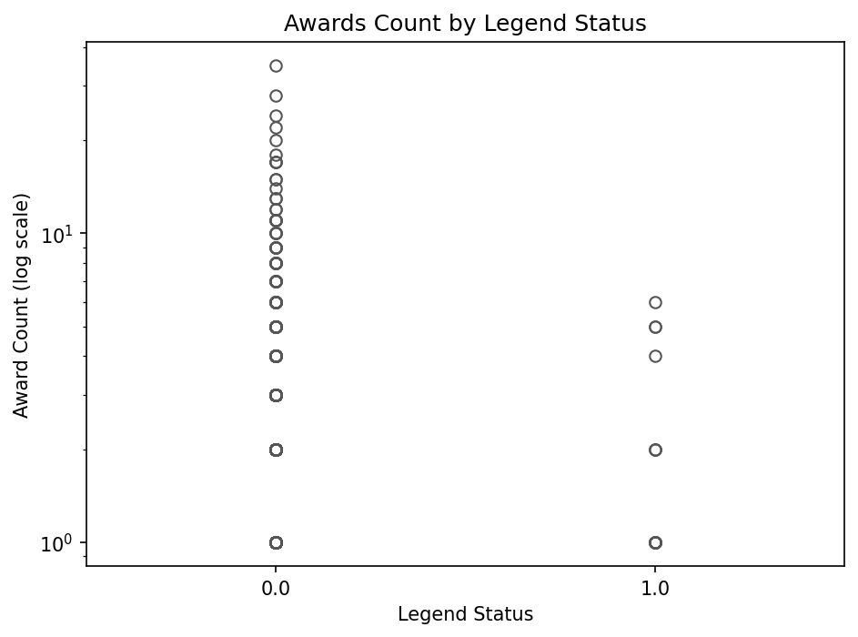
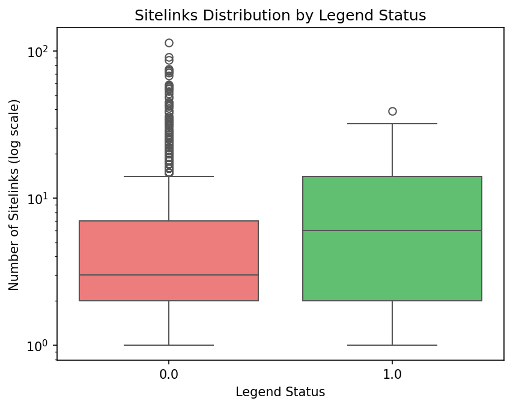

**Occupations:**

- Top occupations: Politician (77), Writer (48), Association football player (47), Actor (36), Singer (24)
- Distribution is similar for legends and non-legends, suggesting occupation alone isn't highly predictive

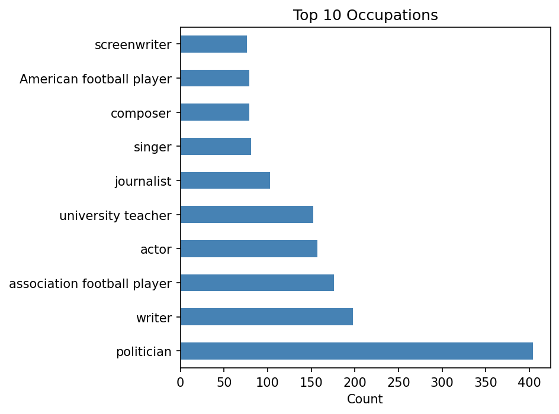
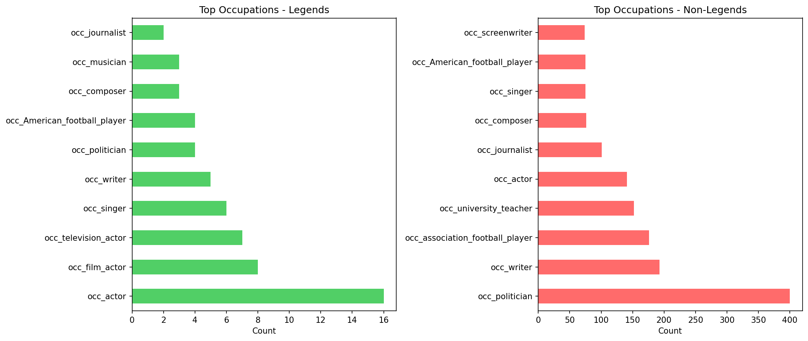

### 4. Feature Relationships (Correlation Heatmap)

The strongest predictor is `sustained_ratio_31_365` itself (correlation = 0.347), which makes sense since it's directly related to the target. Other notable correlations:

- `age_at_death`: -0.208 (younger deaths → more likely to be legends)
- `fame_proxy`: -0.099 (counterintuitive—lower pre-fame can lead to legend status)
- `log_avg_views_pre_death_10d`: -0.084 (weak negative)
- `log_sitelinks`: -0.099 (weak negative)
- `log_award_count`: -0.077 (weak negative)

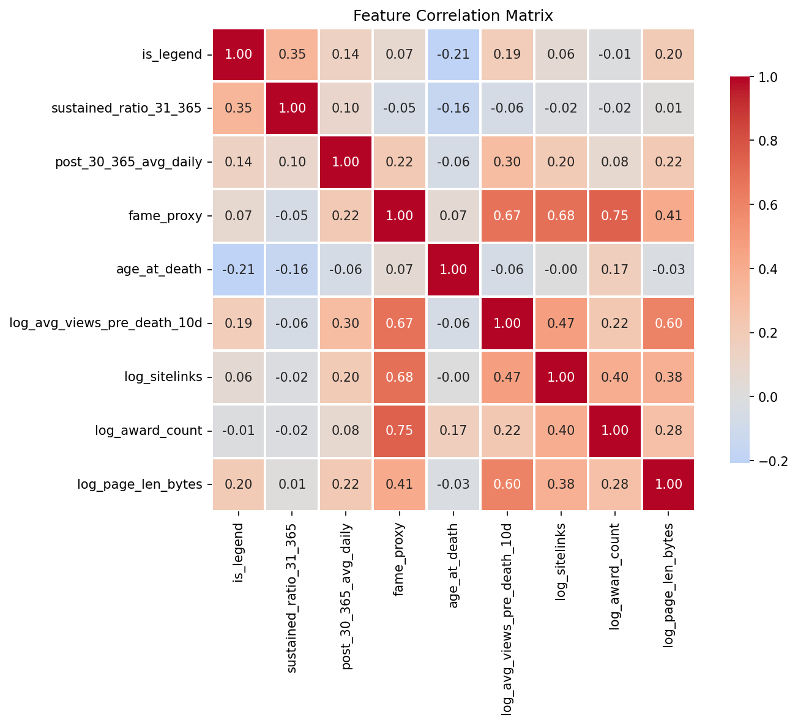

### 5. Initial Feature Ideas

**Engineered Features:**

- **Log transformations**: Normalize right-skewed view counts and metadata
- **Fame proxy**: Composite feature (log(views) + log(sitelinks) + awards - 0.5×log(page_length))
- **Interaction features**: `age_x_fame`, `age_x_year`, `views_per_sitelink`
- **One-hot encoded occupations**: 15+ categories
- **29 features total** (all pre-death, no leakage)

### 6. Anticipated Challenges

- **Class Imbalance**: 2.6% legends → use sample weights, PR-AUC, optimal threshold tuning
- **Temporal Bias**: Fixed through balanced sampling (~314 per year)
- **Missing Data**: Cause of death (dropped), age (imputed), sitelinks/awards (imputed with 0)
- **Sparsity**: Many rare occupation categories → may combine or use top N only

---

## Summary Statistics

| Metric                             | Value                          |
| ---------------------------------- | ------------------------------ |
| Total deceased people              | 2,659                          |
| Train set (2017-2022 deaths)       | 1,757                          |
| Validation set (2023-2025 deaths)  | 902                            |
| Legends                            | 70 (2.6%)                      |
| Non-legends                        | 2,589 (97.4%)                  |
| Sampling per year                  | ~314 (balanced)                |
| Legends median sustained ratio     | 4.20                           |
| Non-legends median sustained ratio | 1.34                           |
| Strongest feature correlation      | sustained_ratio_31_365 (0.347) |
| Age correlation                    | -0.208                         |
| Features (after engineering)       | 29                             |
